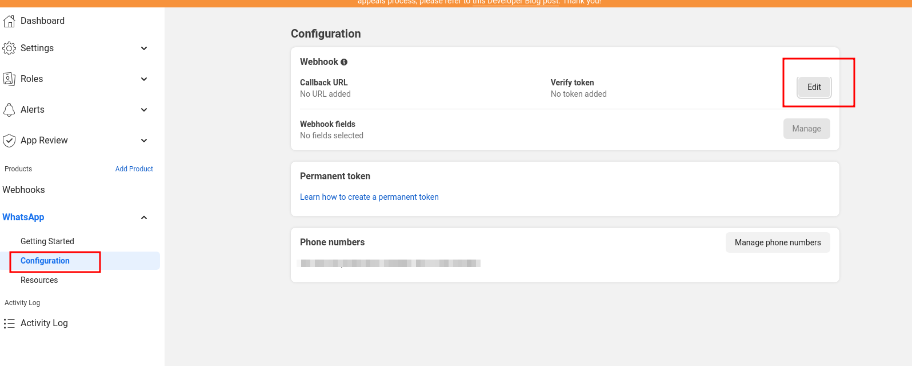
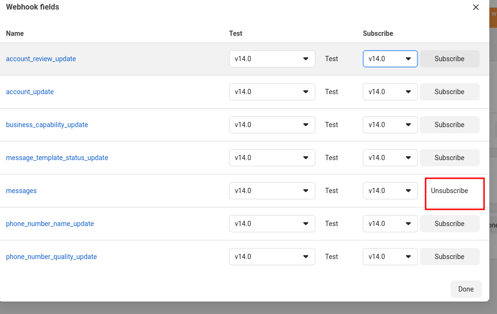

# Tutorial

This 4-part tutorial should help you get started on using the library quickly.

## Steps

### (1) Setting up new app

- Go to [developers.facebook.com](https://developers.facebook.com/) and log in.

- Click on `My Apps`:<br>


- Click on `Create app`:<br>


- Select app type as `Business`:<br>


- Fill in basic info by inputting the display name & email address, and then click `Create app`:<br>


- On the app page, select whatsapp and click `Set up`:<br>


- Select a business account or create one if you don't have. Click `Continue` to finish setting up:<br>


- On the `Getting Started` page, copy the token and number ID as we will need them later:<br>


### (2) Setting up local project

- Start a new project on your local machine:

  ```bash
  # create a new folder
  mkdir hello-whatsapp
  cd hello-whatsapp

  # initialize npm & install the library
  npm init -y
  npm i whatsapp-cloud-api

  # create index.js file
  mkdir src
  touch src/index.js
  ```

- Update `src/index.js` to look as follows:

  ```js
  const { createBot } = require('whatsapp-cloud-api');

  (async () => {
    try {
      // replace the values below from the values you copied above
      const from = 'YOUR_WHATSAPP_PHONE_NUMBER_ID';
      const token = 'YOUR_TEMPORARY_OR_PERMANENT_ACCESS_TOKEN';
      const to = 'PHONE_NUMBER_OF_RECIPIENT'; // your phone number without the leading '+'
      const webhookVerifyToken = 'YOUR_WEBHOOK_VERIFICATION_TOKEN'; // use a random value, e.g. 'bju#hfre@iu!e87328eiekjnfw'

      const bot = createBot(from, token);

      const result = await bot.sendText(to, 'Hello world');

      // Start express server to listen for incoming messages
      await bot.startExpressServer({
        webhookVerifyToken,
      });

      // Listen to ALL incoming messages
      bot.on('message', async (msg) => {
        console.log(msg);

        if (msg.type === 'text') {
          await bot.sendText(msg.from, 'Received your text message!');
        } else if (msg.type === 'image') {
          await bot.sendText(msg.from, 'Received your image!');
        }
      });
    } catch (err) {
      console.log(err);
    }
  })();
  ```

- Update `package.json` to look as follows:

  ```json
  {
    ...
    "scripts": {
      "start": "node ./src/index.js"
    },
    ...
  }

  ```

- Start the app:

  ```bash
  npm start
  ```

Check your whatsapp app to ensure that you have received a text message (`Hello world`).

**Congratulations, you have just sent your first message via the whatsapp API!** 🎉

### (3) Setting up ngrok

By default, the endpoint for whatsapp-related requests will be: `/webhook/whatsapp`.
This means that locally, your URL will be: `http://localhost/webhook/whatsapp`.

You can use a reverse proxy to make the server publicly available. An example of this is [ngrok](https://ngrok.com/download). For the purposes of this tutorial, we will use `ngrok` as our reverse proxy:

- Download ngrok: [https://ngrok.com/download](https://ngrok.com/download).
- Follow the instuctions to set it up.
- Run it: `ngrok http 3000`. You should get a public URL, e.g. `https://1234.ngrok.io`.
- Go to configuration and click on `Edit` webhook:<br>

- Use the url received from ngrok: `https://1234.ngrok.io/webhook/whatsapp` and the verification token you provided above in the index.js file: `const webhookVerifyToken = 'YOUR_WEBHOOK_VERIFICATION_TOKEN';`.
- Finally, hit the `Verify and save` button to verify and save the webhook:<br>

- Ensure you see following on the terminal:<br>

- Also ensure that the dialog for inputting the Callback URL/Verify token on the Facebook dashboard closes successfully (which means there is no error).

**Congratulations, you have just verified your webhook!** 🎉

### (4) Receiving messages

- On the dashboard under `Configuration`, click on `Manage` under `Webhook fields` to add a subscription:<br>


- Click `Subscribe` next to the `messages` webhook to subscribe to new messages:<br>

- Send a message from your whatsapp app on your device. Check your terminal to ensure you get a response as below:<br>


**Congratulations, you have just received your first message via the whatsapp API!** 🎉

### Next steps

Feel free to customize the `index.js` file and play around with the functions as you wish.

You can also use the [API Reference](./API.md) to view definitions of functions and interfaces.

## Tips & Tricks

### 1. Creating long-lived tokens

By default, the access token expires after 24 hours. You can extend this to 2 months.

- Go to [https://developers.facebook.com/tools/debug/accesstoken](https://developers.facebook.com/tools/debug/accesstoken).
- Enter the token you copied and click `Debug`:<br>

- Click `Extend Access Token` to extend it:<br>


This should now extend the token by 2 months: 🎉


## Issues?

Feel free to [create an issue](https://github.com/tawn33y/whatsapp-cloud-api/issues) if you experience any issue.

## Resources

- [Official WhatsApp Cloud API documentation](https://developers.facebook.com/docs/whatsapp/cloud-api/)
